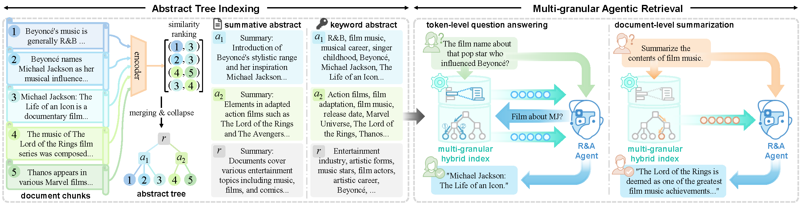

#  ᛉ-RAG: Hierarchical Abstract Tree for Cross-Document Retrieval-Augmented Generation


<center><font color="#666666">Artwork by </font><a href="https://thorolfw.artstation.com/" style="color: #0366d6;">Thorolf Wolfson</a><font color="#666666">.</font></center>

## Overview

$\Psi$-RAG is an efficient and powerful hierarchical tree-based RAG framework designed to tackle complex information-seeking scenarios. It features a *hierarchical abstract tree index* with different abstraction strategies, enabling efficient and precise retrieval with logarithmic time. It employs a *multi-granular agentic retriever* including a powerful Reading & Answering agent with a hybrid retrieval pipeline for diverse user requests. 



## ✨Key Features

- **🌳 Corpus-Level Tree Index**: Generalizes Tree-RAG from passage-level saplings to corpus-level large trees with millions of tokens. Abstration instead of named entity recognition: organize your corpus like a library with <3 hours indexing / >1 million tokens on two 48G RTX4090 GPUs!
- **🎯 Distribution-Adaptive Indexing**: No need for explicit document structure. No need for searching for the optimal cluster numbers. No need for handpicking the initial point. No need for dimension reduction steps. No need for worrying your imbalanced data. A hierarchical tree knows it all! 
- **📚 Flexible Abstraction Mechanism**: Choose one that you prefer: summaries💊 or keywords💊! 
- **👨‍👩‍👧‍👦 Multi-granular and Multifunctional Retrieval Pipeline**: Iterative agentic retrieval empowers cross-document multi-hop tree search. Hybrid retrieval with BM25 navigates fine-grained tree search. Natural reranker support to maximize structured RAG performance. 
- **🧑‍💻 Custom Framework Support**: Built entirely with open-source LLMs. Change backbone models at will like changing ornaments for your Christmas tree!

## Reproduction

See `requirements.txt` for python packages. Our experiments are conducted on Ubuntu 20.04.6 LTS with CUDA 12.8 and Python 3.13.5.

### Environment variables

You may first set some useful environment variables before running our code, including:

```sh
# customize environment variables according to your own needs
export CUDA_VISIBLE_DEVICES=0,1
export HF_ENDPOINT=https://hf-mirror.com	# Hugging Face mirror for users from China
# APIs for closed-source LLMs
export OPENAI_BASE_URL=<your_base_url>
export OPENAI_API_KEY=<your_api_key>
```

For Ollama users, set environment variables including

```sh
export OLLAMA_NUM_PARALLEL=16
export OLLAMA_MAX_LOADED_MODELS=2
export OLLAMA_NUM_GPU=2
export OLLAMA_FLASH_ATTENTION=1
# run ollama in the backend
ollama serve > ~/.ollama/log 2>&1 &
```

### Personalized configuration

We provide benchmark datasets in `./data`. Configurations are python files under `./conf`. Important settings include: 

```python
dataset: str  					# Dataset name.
data_dir: Path  				# Dataset directory, default to "./data"
embed_name: str					# Model name for embedding documents and queries, "[PLATFORM]:[MODEL_NAME]"
embed_cache_dir: Path			# Cache directory of the embedding model, default to os.environ["HF_HOME"]
passage_as_tree: bool			# Whether to activate single-document retrieval setup,
abs_name: str					# Model name for node abstraction, "[PLATFORM]:[MODEL_NAME_OR_PATH]"
abs_cache_dir: Path				# Cache directory of the abstraction agent, default to os.environ["HF_HOME"].
abstract_type: str				# Type of abstract. "summary" for summative text and "keyword" for keywords. 
force_index_from_scratch: bool	# Recreate embeddings and trees even if saved files exist in save_dir.
qa_name: str 					# Model name for agentic retrieval and QA, "[PLATFORM]:[MODEL_NAME]"
qa_cache_dir: Path 				# Cache directory of the R&A agent, default to os.environ["HF_HOME"]
answer_type: str 				# The expected answer type, ("short", "medium", "long")
max_retrieval_time: int 		# Maximum time of retrieval attempts. The first retrieval does not count. 
multithreading_qa_batch_size: int		# Multithread QA for efficient reproduction on large corpus.
force_qa_from_scratch: bool		# Reanswering questions even if the answer result file exists in save_dir.
tree_top_k: int 				# Number of retrieved documents from the tree retriever.
hybrid_search: bool				# If sparse keyword search search (BM25) is enabled
force_sparse_index_from_scratch: bool 	# Rebuild the sparse token vocab even if saved files exist in save_dir.
sparse_top_k: int				# Number of retrieved documents by sparse keyword search. 
rerank: bool					# If reranking is enabled
rerank_name: str				# Model name for reranking, "[PLATFORM]:[MODEL_NAME]"
rerank_cache_dir: Path 			# Cache directory of the reranking model, default to os.environ["HF_HOME"]
rerank_top_k: int 				# Number of final returned documents by the reranker
save_dir: Path					# Save directory of everything intermediate. Set to None to skip saving.
verbose: bool					# Whether to output the detail information during QA.
```

See `./conf/__init__.py` for detailed settings and explanations. 

You can customize configurations by creating a new .py file under `./conf` with a Dict object `conf`, containing setting attributes in the `Config` class in `./conf/__init__.py`. For example, set these two entries in your custom `conf` to enable keyword abstract:

```python
conf = {
    ...
    "abstract_type" : "keyword",
    "max_abs_length": 20,
    ...
}
```

Or you may change backbone LLMs with:

```python
conf = {
    ...
    "embed_name": "ollama:qwen3-embedding:0.6b",
    "abs_name": "ollama:llama3.1:8b",
    "qa_name": "ollama:gemma3:27b",
    "rerank_name": "transformers:BAAI/bge-reranker-large",
    ...
}
```

### Run the "preprocess-indexing-retrieval-evaluation" pipeline

If you want to reproduce our results, simply use our preset configurations named with dataset names. 

```sh
python main.py --config musique_summary
```

We have provided our result files in `./output/results`. Simply run the command above to see evaluation results. If you want to reproduce from scratch, please set `"force_qa_from_scratch": True` in your config file (or set `"save_dir": None` for a single run). If a `<save_dir>` is specified, a new tree Pickle file will be saved after indexing, and a `bm25_<dataset>` directory containing the sparse index will be created in `<save_dir>`. When QA is finished, a result JSON file sharing a name with your config file willl be save in the `<save_dir>/results`. 

:warning: Note that running indexing / sparse indexing / QA from scratch will cover your existing save files in `<save_dir>`!

## Upcoming functionality (after fully open-sourced)

- [ ] Full result files & Pickle files for abstract trees

- [ ] Demos / Quick guide

- [ ] Custom dataset / model code examples

## TODOs

- [ ] vLLM support
- [ ] ...